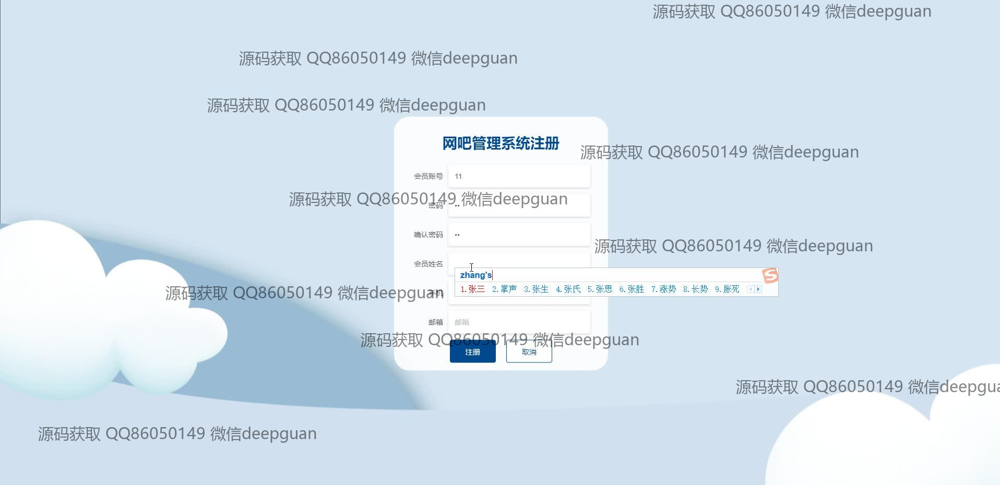

<h1 align="center">网吧管理系统</h1>

## 简介
网吧管理系统：角色分为管理员、会员、网管；功能包括用户注册与管理、电脑信息管理、商品信息与类型管理、支付功能、多角色权限管理，基于Spring Boot框架开发，界面设计简洁易用。    --计算机毕业设计源码；毕设源码；java毕业设计源码

## 联系方式

<h3 align="center">获取完整代码与数据库文件 + 微信：deepguan QQ: 86050149 QQ群: 783742310</h3>

<h3 align="center">可帮忙远程部署 包运行成功！提供远程部署、修改代码、设计文档指导、代码讲解等服务！</h3>

## 功能介绍（完整见运行截图）
管理员：管理员可以通过系统的注册和登录界面进行登录，进入系统后可以管理用户、电脑、商品、会员等信息。管理员能够进行商品信息的增加、删除、修改和查看，并管理商品类型和订单。在用户管理中，管理员可以新增、删除和修改用户信息，查看消费和充值记录。电脑管理模块允许管理员查看和管理电脑的使用状态。不同功能模块通过界面顶部的导航栏进行切换，支持查看和管理上机及下机流程，便于管理员全面掌握网吧运营。

网管：网管有权限登录系统，并可以管理自己相关的账号信息和密码修改。网管主要负责监控电脑状态，并协助会员解决上机或下机过程中可能遇到的问题。网管可以通过界面对电脑的信息进行操作，包括查看电脑具体状态和分布，处理调用请求等。支付界面允许网管协助会员进行账目结算，通过多种支付选项完成费用支付，同时能够管理网管记录和备注信息。

会员：会员可以通过注册和登录界面进入系统，注册时需提供必要的个人信息。登录后，会员可以查看和管理个人账户信息，享受会员专属的服务和优惠。会员能够通过电脑管理模块查看电脑的详细信息和上机状态，同时可以通过商品管理模块查看商品信息并进行购买。在支付界面，会员可选择适合的支付方式完成订单支付和结算，管理个人消费记录和账户充值历史。

访客：未注册的访客可以浏览网站的大部分信息，如商品列表和基本的网吧信息，但不能享受会员专属功能。访客在界面上可以查看各个功能模块的概况，了解网吧的基本服务，同时可以使用注册界面提交个人信息生成会员账户，以获取完整的服务体验并跨入会员管理模块中进行个性化操作。

## 运行截图

本代码来源于网络,仅供学习参考使用!

